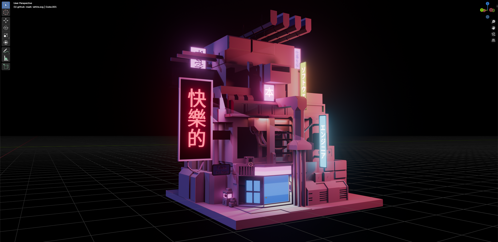
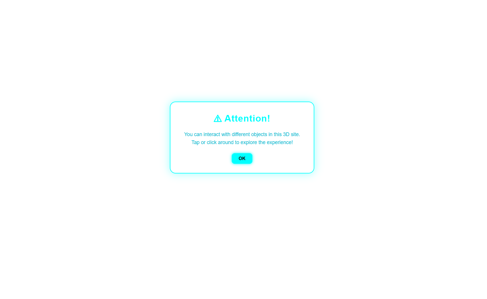
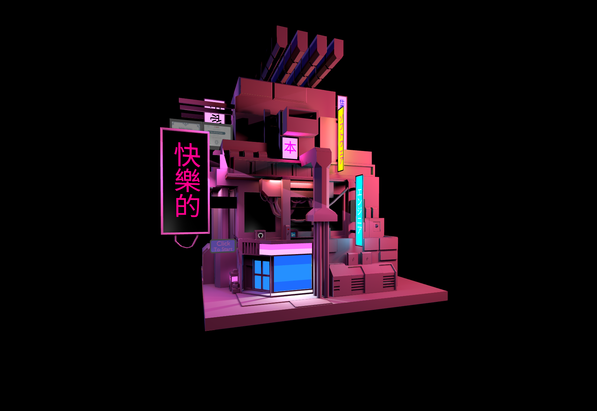
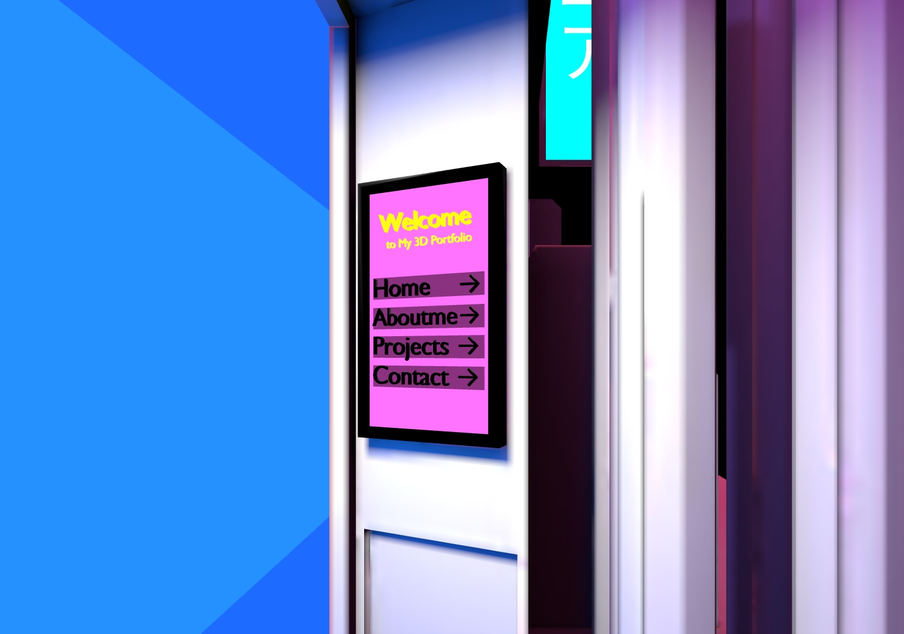
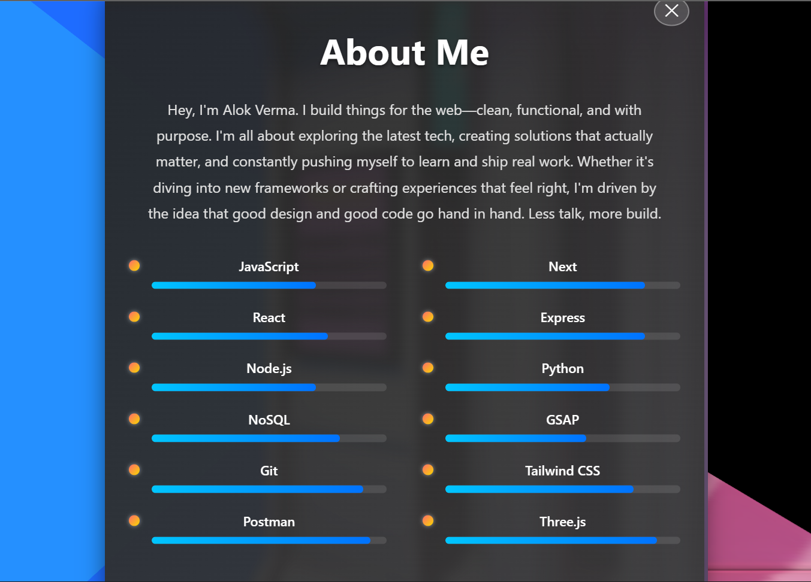
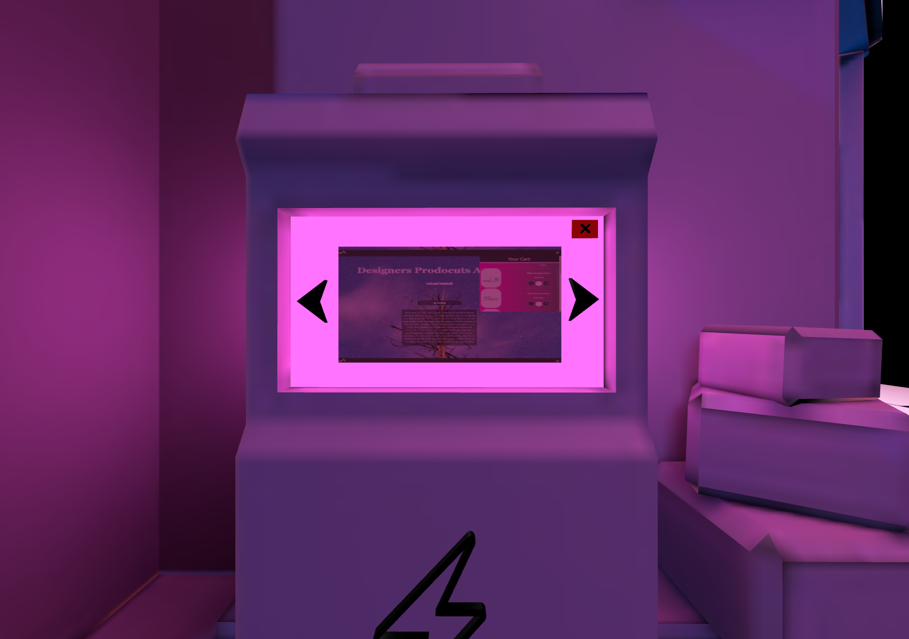
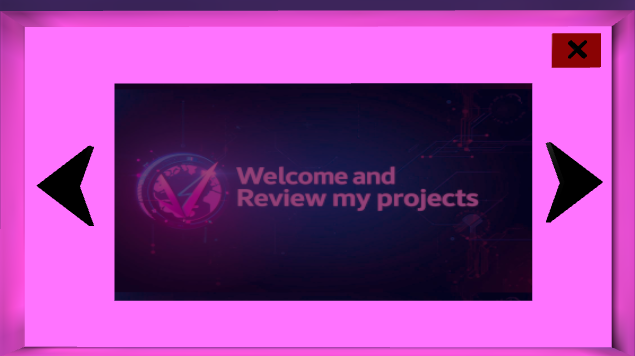
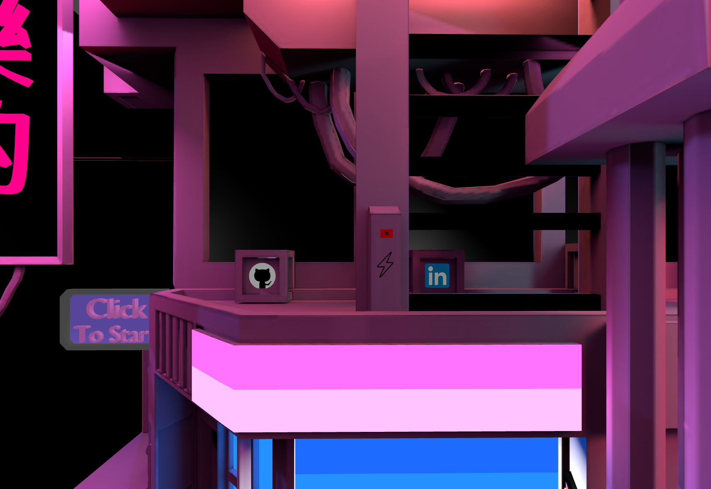

## 

  <!-- Core project info -->
  
  
  <!-- 
   -->
  
  
   

  <!-- Tech stack -->
  
  
  
  
  
  
  
  
  
  
  
  
  

---
## Deployed link  - https://avportfolio-fawn.vercel.app/

## 📋 Overview

This project demonstrates expertise in:
- **3D Modeling (Blender)**
- **Lighting & Texture Baking**
- **Real-Time Rendering (Three.js)**
- **Animation & Scene Control (GSAP)**
- **Web Optimization (Vite + GLTF)**
- **Automated Testing (Vitest)**
- **Deployment**

---

## 🎨 Design & Modeling in Blender

The design process started inside **Blender**, focusing on:
- A **floating Bungalow** layout with layered geometry.
- **Custom neon signs**, glowing panels, and emissive materials.
- Careful **composition and scale** for camera movement and storytelling.
- **Low-poly optimization** to ensure smooth web performance.

Each 3D object was named and grouped systematically (`Sign_01`, `Building_02`,), to simplify later identification and manipulation inside **Three.js**.

  

---

## 🔥 Baking Process

Since real-time lighting can be GPU-heavy, lighting was **baked in Blender Cycles** and exported as textures.

### Steps:
1. **UV Unwrapping** all static meshes.
2. Creating a **new image texture** for each baked surface.
3. Baking **diffuse + lighting passes** in Cycles.
4. Exporting baked textures and assigning them back in Blender.
5. Verifying correct UV placement under emissive materials.

This ensured the portfolio looks cinematic **without requiring dynamic lights** — improving both **performance** and **aesthetic consistency**.

---

## 🧠 Refactoring & Testing
After core functionality was complete, the project was modularized into logical components:

- core/scene.js — initializes scene and lights.

- core/renderer.js — manages WebGLRenderer setup.

- core/camera.js — defines camera movement logic.

- utils/interaction.js — handles touch/mouse events.

Unit tests were added using Vitest, verifying:

- Scene creation and light configuration.

- Renderer initialization and pixel ratio handling.

- Material update functions.

- Pointer coordinate normalization.

Tests run automatically on GitHub Actions for continuous integration.

---

## ⚙️ Technology Stack

- **JavaScript** 

- **Three.js** — 3D rendering and scene graph

- **GSAP** — Timing, tweening, animations

- **Vite** — Dev server + bundler

- **GLTFLoader / DRACOLoader** — model loaders

- **HTML & CSS** — structure and styling

- **WebGLRenderer** configured for baked lighting.

---

✨ Key Features

- ⚡ **High-performance** baked lighting (no runtime lights).

- 🌀 **GSAP animations** for camera and sign interactions.

- 💻 **Responsive** orbit and touch controls.

- 🎨 **HDRI-based reflections** and global illumination.

- 🧩 **Componentized architecture** for maintainability.

- 🧪 **Vitest**-tested rendering utilities.

- 🌐 **Optimized for web delivery** (under 5MB model).

- 🏙️ **Immersiv**e cyberpunk environment with interactive UI.

---

## Screenshots

### Preview:

  

  

### Sign interaction:

  

  

### Unique project display:

  

  

### Simple and Efficient contact form:

  

